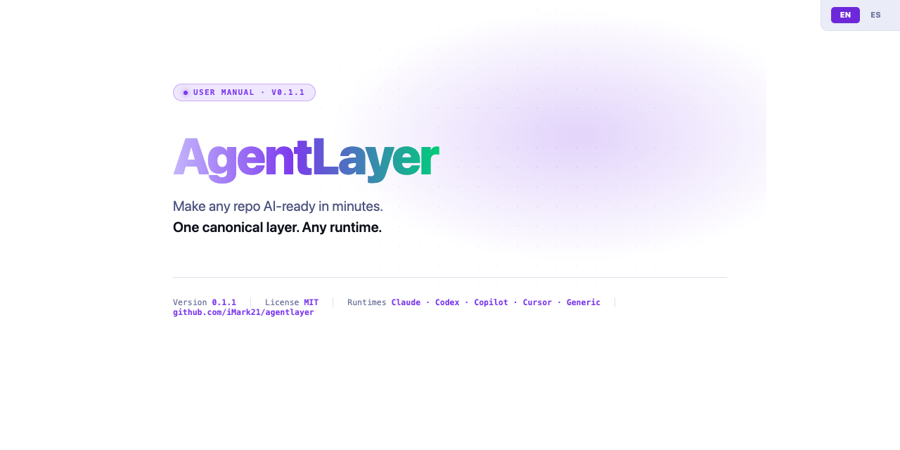

# agentlayer



Your AI assistant writes better code when it actually knows your project.

agentlayer adds a structured context layer to any existing repository so that Codex, Claude Code, Copilot, Cursor — or any AI — stops guessing and starts following your real architecture, conventions, and decisions from the first prompt.

No dependencies. Any AI runtime. Any tech stack.

## Does this sound familiar?

- You open Codex or Claude on an existing project and the first ten minutes are spent explaining the architecture, again
- Your `AGENTS.md` or `CLAUDE.md` has grown to 200+ lines and the AI still ignores half of it
- You ask the AI to add a feature and it invents a folder structure that does not match your project
- A new teammate joins and has to figure out the codebase from scratch because there is no structured context
- A legacy project has no AI setup at all and you do not know where to start

agentlayer solves all of these. It gives your repository a canonical `.ai/` layer that any AI reads before acting — so it understands the product, follows your conventions, and remembers what was already built.

## What you get: a team of agents

When you install agentlayer, your repo gets a team of specialized agents that follow a structured workflow:

```
┌──────────────────┐   ┌──────────────────┐   ┌──────────────────┐   ┌──────────────────┐
│  agent-explore   │──>│   agent-plan     │──>│   agent-code     │──>│  agent-verify    │
│                  │   │                  │   │                  │   │                  │
│ Maps the area    │   │ File-level plan  │   │ Step-by-step     │   │ Tests, criteria, │
│ before you touch │   │ with tests and   │   │ implementation.  │   │ residual risk.   │
│ anything         │   │ trade-offs       │   │ Stops if blocked │   │                  │
└──────────────────┘   └──────────────────┘   └──────────────────┘   └──────────────────┘
```

Plus specialized agents for **bug fixes** (`agent-fix`), **refactors** (`agent-tech`), and **investigations** (`agent-spike`).

Plus reusable skills: **context refresh**, **feature scaffold**, **migration audit**.

All generated automatically. Agents are Markdown playbooks — they work with any AI, not just one vendor.

## The structure is always the same. The content is yours.

Without agentlayer, asking an AI to "set up an AI layer" produces something different every time — whatever the model decides that session.

With agentlayer, every installation produces the same skeleton:

- 8 agents with defined responsibilities
- 4 reusable skills
- 5 context files for architecture, dependencies, features, repository workflow, and recent changes
- Scoped rules by file type
- Thin runtime adapters for each AI tool

The **structure** is deterministic. The **content** is filled with real knowledge from your repository.

## Install it

There are two ways. Pick the one that fits your setup.

### Option 1 — Let your AI do it (any AI)

Paste this into your AI assistant — Codex, Claude Code, Copilot, Cursor, or any other:

```
Fetch https://raw.githubusercontent.com/iMark21/agentlayer/main/assistant-installer/PROMPT.md
and follow the complete installation workflow defined there for this repository.
```

The AI fetches the agentlayer spec, **asks you which AI runtime(s) you want**, audits the repo, and generates a grounded `.ai/` layer with real project knowledge — not generic placeholders.

> If your AI cannot fetch URLs directly, download the file first:
> ```bash
> curl -sO https://raw.githubusercontent.com/iMark21/agentlayer/main/assistant-installer/PROMPT.md
> ```
> Then tell your AI: `Read PROMPT.md in this directory and follow the installation workflow.` Delete it when done.

### Option 2 — Use the CLI (deterministic, no AI at install time)

```bash
# Install the CLI (clone somewhere persistent — /tmp gets cleaned and breaks the symlink)
git clone https://github.com/iMark21/agentlayer.git ~/.agentlayer
cd ~/.agentlayer && bash install.sh

# Bootstrap your project
agentlayer install /path/to/your-repo \
  --runtimes claude,generic \
  --project-type ios
```

The CLI generates the canonical structure deterministically. After install, tell your AI to ground the context files with real repo knowledge:

```
Read CLAUDE.md and the .ai/ layer. The context files are templates —
audit the repository, replace the placeholders with real project knowledge,
and summarize what you found.
```

Batch or CI installs:

```bash
agentlayer install /path/to/your-repo \
  --runtimes codex,claude,copilot,cursor,generic \
  --project-type android \
  --non-interactive --yes
```

## Now use it

After install, your AI has context and a structured workflow. Here is what working with it looks like.

### Example: adding a login screen

**Step 1 — Explore the area:**

> Use agent-explore. I need to add a login screen with email and password.

The AI reads `.ai/context/architecture.md`, maps your existing auth code, finds reusable patterns, and reports back — before writing a single line.

**Step 2 — Plan:**

> Use agent-plan. Plan the login screen feature.

You get a file-level plan: which files to create, which to modify, what tests to add, what state pattern to use. Review and approve before any code is written.

**Step 3 — Implement:**

> Use agent-code. Implement the approved plan.

The AI codes task by task. If a step fails, it stops and reports instead of bulldozing ahead.

**Step 4 — Verify:**

> Use agent-verify. Verify the login feature.

Tests run, acceptance criteria are checked, and any residual risk is documented.

The feature is now recorded in `.ai/features/login.md` — so next time anyone (human or AI) touches auth, they have context.

### Example: fixing a bug

> Use agent-fix. The total is not updating when I remove an item from the cart.

The AI loads the project context, finds the root cause, writes a failing test, applies the smallest safe fix, verifies it passes, and records the gotcha in `.ai/context/recent-changes.md`.

### Example: should I refactor this?

> Use agent-spike. Is it worth extracting the payment logic into its own module?

You get a structured analysis: pros, cons, estimated effort, risks, and a recommendation — proceed, pivot, or abandon. No code written, just a decision document.

## What gets installed

```
.ai/
├── context.md                   # what the product does and how it is built
├── context/
│   ├── architecture.md          # layers, modules, data flow
│   ├── dependencies.md          # libraries, SDKs, versions
│   ├── features.md              # feature inventory and status
│   ├── repository.md            # git workflow, CI, branching
│   └── recent-changes.md        # what changed recently, gotchas
├── decision-framework.md        # standard patterns for common changes
├── rules/                       # guardrails by file type
├── agents/
│   ├── agent-explore.md
│   ├── agent-plan.md
│   ├── agent-code.md
│   ├── agent-verify.md
│   ├── agent-fix.md
│   ├── agent-tech.md
│   ├── agent-spike.md
│   └── agent-context-bootstrap.md
├── skills/                      # 4 reusable checklists
├── features/                    # memory per completed feature
└── archive/                     # past plans and fixes
```

Plus a thin adapter at the root for your AI runtime (`AGENTS.md`, `CLAUDE.md`, `.github/copilot-instructions.md`, `.cursor/rules/agentlayer.mdc`, or `AGENTLAYER.md`).

## Supported runtimes

| Runtime | Adapter generated | Install flag |
| --- | --- | --- |
| Codex | `AGENTS.md` | `--runtimes codex` |
| Claude Code | `CLAUDE.md` | `--runtimes claude` |
| GitHub Copilot | `.github/copilot-instructions.md` | `--runtimes copilot` |
| Cursor | `.cursor/rules/agentlayer.mdc` | `--runtimes cursor` |
| Any other AI | `AGENTLAYER.md` | `--runtimes generic` |

Use `--runtimes all` to generate every adapter. Use `generic` when you want a tool-agnostic setup.

## Supported project types

| Type | Detected by | Rules generated |
| --- | --- | --- |
| `android` | `settings.gradle`, `AndroidManifest.xml` | Kotlin, Compose |
| `ios` | `.xcodeproj`, `.xcworkspace`, `Package.swift` | Swift, SwiftUI |
| `web` | `package.json`, `pnpm-lock.yaml` | TypeScript, React |
| `backend` | `go.mod`, `Cargo.toml`, `pyproject.toml` | Code, UI |
| `generic` | Fallback | Code, UI |

The CLI auto-detects the project type from the repo structure. Override with `--project-type`.

## The core idea

The system is runtime-agnostic. agentlayer works on any tech project if you define these five things well:

1. Product context and architecture
2. Precise rules by file type or module
3. A decision framework for common changes
4. Specialized agents or flows by task type
5. Useful memory of what has already been done

The stack, the language, and the AI runtime can all change. These five pieces are what make a repository legible to any assistant from the first session.

## Read more

- [MANUAL.md](MANUAL.md) — Full reference: all commands, flags, workflows, and advanced usage
- [CONTRIBUTING.md](CONTRIBUTING.md) — How to contribute
- [CHANGELOG.md](CHANGELOG.md) — Version history
