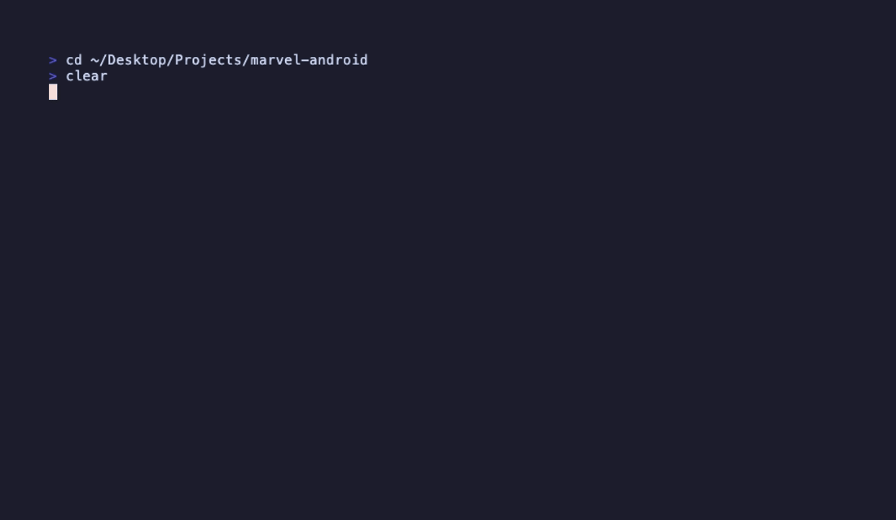

# sdd-harness

> **v1.0.0-alpha** — Framework rewrite. Repo renamed from `agentlayer` v0.5.0. Core `.ai/` layer ported and dogfooded; CLI rewritten end-to-end.

A runtime-agnostic **Spec-Driven Development harness** that any AI can operate. Drop it into a repo and the team — humans and AIs alike — follow the same disciplined loop: **spec first, code second, verify against spec**.

## Status

v1.0.0-alpha ships the framework core (`.ai/` layer + 5-line bootloaders) and a rewritten CLI that lays it down in any target repository. Templates live under `templates/` and are copied verbatim with placeholder substitution.

If you arrived from `iMark21/agentlayer` looking for the v0.5.0 `agent-explore → plan → code → verify` flow: that has been replaced. See [CHANGELOG.md](CHANGELOG.md) for the rupture rationale and migration guidance.

## Demo

Installing sdd-harness in a real Android repo (Marvel API client, last commit 2021, no prior AI layer) and launching the first spec. The pre-commit hook refuses the code-only commit; once the spec lands, the same code is accepted.



## What sdd-harness gives you

A `.ai/` directory that is the single source of truth for any AI runtime:

```
.ai/
├── ROUTING.md      — how any AI operates the project
├── PRODUCT.md      — vision and non-goals
├── CONTEXT.md      — living state
├── BACKLOG.md      — stories (SH-NNN format)
├── README.md       — entrypoint map
├── adrs/           — architecture decisions, MADR format
├── agents/         — reusable AI roles (spec-writer to start)
├── commands/       — repeatable workflows (spec, story, implement, verify, review, release)
├── hooks/          — runtime-agnostic shell scripts; config.sh per-project tunable
├── notes/          — distilled mini-tutorials
└── specs/          — PRD, glossary, acceptance Gherkin, your protocol contracts
```

Plus 5-line bootloaders at the repo root: [`CLAUDE.md`](CLAUDE.md), [`AGENTS.md`](AGENTS.md), and the same pattern for any future AI runtime.

## The discipline

```
spec  →  human + agent review  →  implement (TDD-light)  →  verify-against-spec  →  merge
```

Enforced by `.ai/hooks/pre-commit-spec-check.sh`: feature branches that touch code must also touch a spec or ADR. The path globs are project-configurable in [`.ai/hooks/config.sh`](.ai/hooks/config.sh).

See [`.ai/notes/spec-driven-development.md`](.ai/notes/spec-driven-development.md) for the full primer.

## Lineage

sdd-harness extracts the disciplined `.ai/` layer iterated through multiple phases in a real production codebase under non-trivial constraints (multiple transports, hardware integration, end-to-end test harness, deterministic CI). The discipline survived contact with reality — which is the bar for shipping a framework rather than a template. Domain-specific artifacts are excluded; only the generic SDD discipline is kept.

## Adopting it

```bash
# 1. Get the CLI (clone somewhere persistent)
git clone https://github.com/iMark21/sdd-harness.git ~/.sdd-harness
cd ~/.sdd-harness && bash install.sh

# 2. In your target repo
cd /path/to/your-repo
sdd-harness init
```

`sdd-harness init` auto-routes:

- **Fresh repo** → lays down `.ai/` plus root bootloaders (`CLAUDE.md`, `AGENTS.md`).
- **Repo already has AI files** → routes to `standardize`, which backs them up under `.ai-backup-<timestamp>/` and installs the new layout.

Then customize `.ai/PRODUCT.md`, `.ai/BACKLOG.md`, `.ai/CONTEXT.md` for your project. ADR 0008 (runtime-agnostic AI layer) stays as-is; add your own ADRs starting at 0009 or higher. Tune `.ai/hooks/config.sh` to match your stack's code paths.

## Roadmap

- **v1.0.0-alpha** (current) — Framework core ported and dogfooded.
- **v1.0.0-beta** — CLI rewrite: `sdd-harness init` lays down the new `.ai/` in a target repo. Plugin-based CI scaffolding per stack (Swift/Python/JS/Go).
- **v1.0.0** — Public migration: repo renamed to `iMark21/sdd-harness`, commit timestamps sanitized, CHANGELOG migration guide for v0.5.0 users.
- **v1.1.0+** — Governance mirror (auto-update `CONTEXT.md` on phase close), additional reviewer agents, optional integrations.

## License

MIT. See [LICENSE](LICENSE).

## Read more

- [`.ai/ROUTING.md`](.ai/ROUTING.md) — start here for any AI
- [`.ai/PRODUCT.md`](.ai/PRODUCT.md) — vision and non-goals
- [`.ai/notes/spec-driven-development.md`](.ai/notes/spec-driven-development.md) — SDD primer
- [`.ai/adrs/0008-runtime-agnostic-ai-layer.md`](.ai/adrs/0008-runtime-agnostic-ai-layer.md) — why `.ai/` and not `.claude/`
- [CHANGELOG.md](CHANGELOG.md) — version history
