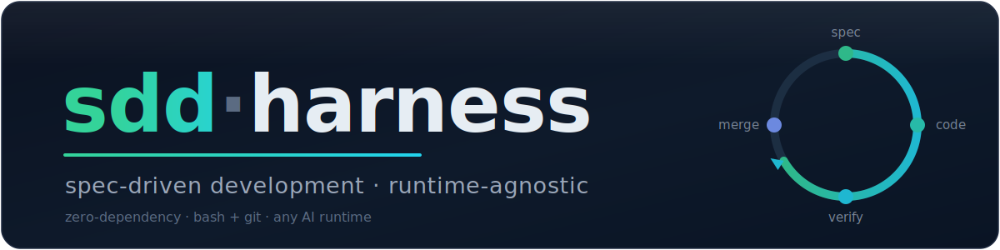

<p align="center">
  
</p>

<p align="center">
  <a href="LICENSE"></a>
  <a href="https://github.com/iMark21/sdd-harness/actions/workflows/ci.yml"></a>
  <a href="https://github.com/iMark21/sdd-harness/releases"></a>
  <a href="#install"></a>
</p>

# sdd-harness

A runtime-agnostic **Spec-Driven Development harness** that any AI can operate. Drop it into a repo and the team — humans and AIs alike — follow one disciplined loop: **spec first, code second, verify against spec**. The pre-commit hook makes it non-optional.

---

## Contents

- [Why](#why)
- [Install](#install)
- [How it works](#how-it-works)
- [Using it day to day](#using-it-day-to-day)
- [What you get](#what-you-get)
- [Proven in a real adoption](#proven-in-a-real-adoption)
- [Roadmap](#roadmap)
- [License · Read more](#license)

---

## Why

Most "AI in your repo" setups lock you into one assistant, drop ungoverned context, and let code drift from intent until nobody can explain why anything is the way it is.

sdd-harness fixes three things at once:

- **Spec before code, enforced.** A pre-commit hook blocks feature commits that change code without touching a spec or ADR. The discipline is structural, not a guideline people forget.
- **Runtime-agnostic.** The brain lives in `.ai/`. Any AI (Claude Code, Codex, Cursor, Copilot, Gemini, …) operates the project by reading it. Swapping assistants is a 5-line pointer file, not a migration. (See [ADR 0008](.ai/adrs/0008-runtime-agnostic-ai-layer.md).)
- **Cold-start onboarding.** Its highest-value scenario is the codebase nobody currently understands — a legacy or inherited repo. `init` bootstraps vision, decisions, and vocabulary *from the repo itself*, so a contributor (or an AI) can make a safe change without tribal knowledge.

It is **zero-dependency** (bash + git only) and ships nothing stack-specific — your ADRs declare your architecture; the harness only ensures you follow them. It was extracted from a `.ai/` layer iterated through many phases in a real production codebase under non-trivial constraints; only the generic discipline is kept.

## Install

### Per-project (recommended)

No global installation needed. In any repository:

```bash
curl -sSL https://raw.githubusercontent.com/iMark21/sdd-harness/main/bootstrap.sh | bash -s -- --stack python
```

Replace `python` with your stack: `swift`, `android`, `node`, `go`, `rust`, or `generic`.

This downloads all templates, tools, and hooks directly into your repo. Then:
- **With AI:** `bash -s -- --stack python --ai-setup` downloads `.ai/BOOTSTRAP-AI.md`. Open it with any AI that has repo access.
- **Manual:** `cat .ai/BOOTSTRAP.md` to fill `PRODUCT.md` / `BACKLOG.md` / `CONTEXT.md` / glossary by hand.

### Global installation (optional)

If you want `sdd-harness` CLI on PATH:

```bash
git clone https://github.com/iMark21/sdd-harness.git ~/.sdd-harness
bash ~/.sdd-harness/install.sh
sdd-harness init /path/to/repo --stack python
```

Or one-command clone + init:

```bash
bash ~/.sdd-harness/quick-start.sh user/repo --stack python
```

## How it works

Every feature on a `feat/*` or `feature/*` branch goes through one loop:

```
spec  →  review (human + agent)  →  implement  →  verify against spec  →  merge
```

`.ai/hooks/pre-commit-spec-check.sh` enforces the first arrow: touch implementation surface on a `feat/*` or `feature/*` branch without touching `.ai/specs/` or `.ai/adrs/`, and the commit is refused. By default, implementation surface means every tracked non-documentation path, so iOS, web, backend, monorepos, and unusual layouts are protected without stack-specific setup. Branches `chore/*`, `docs/*`, `fix/hotfix/*` are exempt. The full primer is in [`.ai/notes/spec-driven-development.md`](.ai/notes/spec-driven-development.md).

<details>
<summary><strong>Walkthrough: installing into a real, unmaintained Android repo</strong></summary>

The subject is deliberately [`iMark21/marvel-android`](https://github.com/iMark21/marvel-android) — last commit October 2021, no active maintainer, a repo the runner does not have in head. That is the point: the harness earns its keep on code nobody is currently the expert on.

**1. Install in the clean repo**

```bash
$ cd marvel-android        # last commit Oct 2021, no AI files
$ sdd-harness init . --yes
Fresh repo detected. Routing to 'install'.
  Project name: marvel-android
  Branch: develop
[install.sh] linked pre-commit -> .ai/hooks/pre-commit-spec-check.sh
...
Done. Next steps:
  1. Open .ai/BOOTSTRAP.md — it tells you (or your AI) how to fill
     PRODUCT/CONTEXT/BACKLOG/glossary from this repo.
```

**2. Start a feature**

```bash
$ git checkout -b feat/marvel-login
```

**3. Commit code without a spec — the hook refuses**

```bash
$ git add src/LoginViewModel.kt && git commit -m 'feat: login view-model'

[sdd-check] Spec-Driven Development violation.
This feature commit changes code but does not touch .ai/specs/ or .ai/adrs/.
  1. Update the relevant spec and re-stage it, or
  2. Add an ADR, or
  3. SH_SDD_SKIP=1 git commit ...  (documented exceptions only)
```

**4. Write the spec first** — by hand, or paste `.ai/BOOTSTRAP.md`'s prompt into your AI:

> Read `.ai/commands/spec.md`, then draft a spec for the login screen
> (Marvel public API, token in EncryptedSharedPreferences, 24h expiry,
> comics list on HTTP 200, clear error on 401). Save it to
> `.ai/specs/SH-001-marvel-login.md` following the structure `spec.md`
> documents. Read `.ai/PRODUCT.md` and `.ai/specs/glossary.md` first.

**5. Commit spec and code together — passes**

```bash
$ git add .ai/specs/SH-001-marvel-login.md src/LoginViewModel.kt
$ git commit -m 'feat: login spec + view-model'
[feat/marvel-login 95d194c] feat: login spec + view-model
```

A short GIF of the same flow: [`docs/demo.gif`](docs/demo.gif).

</details>

## Using it day to day

### Development workflow

**Branches and commits:**

- **Branch from** `develop`, never from `main`.
- **Branch naming**: `type/short-description` (e.g., `feat/login-pager`, `fix/timeout-race`).
- **Commit message**: `[branch_name] type: "title"` (e.g., `[feat/login-pager] feat: "add infinite scroll"`).
- **Merge back to `develop`**: squash merge, always.
- **Promote to `main`**: once per release, from `develop` only. Squash merge the entire release.

**Pre-commit hook:**

`.ai/hooks/pre-commit-spec-check.sh` enforces spec-first on `feat/*` and `feature/*` branches:

- Touch code **without** touching `.ai/specs/` or `.ai/adrs/` → commit **blocked**.
- Update a spec, then commit code → commit **passes**.
- `chore/*`, `docs/*`, `fix/hotfix/*` branches are **exempt**.
- Override (documented exceptions only): `SH_SDD_SKIP=1 git commit ...`

**Versioning and release:**

Release process lives in `.ai/commands/release.md`. Typical flow:

1. **Propose the release**: `git checkout -b release/vX.Y.Z develop`
2. **Ask AI to follow `.ai/commands/release.md`** — updates version numbers, CHANGELOG, etc.
3. **Merge to main**: `git checkout main && git merge --squash release/vX.Y.Z && git commit -m "release: vX.Y.Z"`
4. **Tag**: `git tag vX.Y.Z && git push origin main --tags`
5. **Back-merge to develop**: `git checkout develop && git merge main && git push`

Use **semantic versioning** (MAJOR.MINOR.PATCH). Releases are tagged on `main` only.

### Commands

The loop is driven by seven Markdown procedures in `.ai/commands/`. You don't
"execute" them like binaries — you (or your AI) ask it to *follow that file*.
Each file has `Usage`, `Inputs`, `Procedure`, `Done criteria`.

| Command | When you run it | Example (what you tell your AI) |
|---|---|---|
| `spec <id>` | Turn a backlog story into a spec + acceptance Gherkin | *"Follow `.ai/commands/spec.md` for SH-002"* |
| `story <id>` | Expand the spec into a file-level implementation plan | *"Follow `.ai/commands/story.md` for SH-002"* |
| `implement <id>` | Execute the plan, tests-first, respecting your ADR layering | *"Follow `.ai/commands/implement.md` for SH-002"* |
| `verify <id>` | Check the code against every acceptance scenario | *"Follow `.ai/commands/verify.md` for SH-002"* |
| `review` | Security + architecture review of the current diff | *"Follow `.ai/commands/review.md`"* |
| `release [lane]` | Drive your project's own release toolchain | *"Follow `.ai/commands/release.md` beta"* |
| `phase-close <next>` | Close the phase: update `CONTEXT.md` + `BACKLOG.md` | *"Follow `.ai/commands/phase-close.md` F2"* |

### What the pre-commit hook allows and blocks

`.ai/hooks/pre-commit-spec-check.sh` runs on every commit:

| Situation | Result |
|---|---|
| `feat/*` or `feature/*` branch, touches implementation surface **and** a spec/ADR | ✅ allowed |
| `feat/*` or `feature/*` branch, touches implementation surface **without** any `.ai/specs/` or `.ai/adrs/` change | ⛔ **blocked** |
| `feat/*` or `feature/*` branch, touches only specs/docs | ✅ allowed |
| `chore/*`, `docs/*`, `fix/hotfix/*` branch | ✅ exempt — never blocked |
| Any branch, no code touched | ✅ allowed |

"Implementation surface" is whatever `SH_CODE_GLOBS` includes and
`SH_CODE_EXCLUDE_GLOBS` does not exclude in [`.ai/hooks/config.sh`](#install).
The default is deliberately broad: include `*`, then exclude `.ai/`, runtime
metadata, docs, and common text-only files. Narrow it only for known
repo-specific exceptions. `init` warns at install time if nothing is protected.

**Prohibitions (by design):**

- No feature implementation on `feat/*` or `feature/*` without its spec — the whole point.
- No silent bypass: the override is explicit and logged in your shell history.
- The hook never edits your files or auto-writes a spec — it only refuses.

**Documented-exception override:**

```bash
SH_SDD_SKIP=1 git commit -m 'fix: typo in log message'
```

Use it for typo fixes, pure renames, generated files — **not** for "I'll write
the spec later". If you're skipping because the change is real, write the spec.

### Hooks installed

`./.ai/hooks/install.sh` wires two hooks (re-run it after editing `config.sh`):

| Git hook | Script | Does |
|---|---|---|
| `pre-commit` | `pre-commit-spec-check.sh` | The gate above. Exit non-zero blocks the commit. |
| `post-commit` | `post-edit-trace.sh` | Prints which spec/ADR and code files the commit touched — a passive trace for end-of-day reflection. Never blocks. |

### Use cases

<details>
<summary><strong>1. Greenfield repo</strong></summary>

```bash
sdd-harness init . --yes
# fill PRODUCT.md + the first BACKLOG row (or paste .ai/BOOTSTRAP.md to your AI)
git checkout -b feat/first-feature
# ask AI: follow .ai/commands/spec.md for FOO-001
# ask AI: follow .ai/commands/implement.md for FOO-001
git add .ai/specs/FOO-001*.md src/...   # spec + code together
git commit -m 'feat: FOO-001 ...'        # hook passes
```
</details>

<details>
<summary><strong>2. Legacy repo nobody remembers (cold-start)</strong></summary>

Paste the [AI-assisted install](#or-let-your-ai-install--audit--fill-it) line.
The AI audits the repo and fills the context. Then pick a real TODO from the
migrated backlog and run the loop. This is exactly what was done on
[`marvel-android`](#proven-in-a-real-adoption) (`MAR-002` pager).
</details>

<details>
<summary><strong>3. Swapping or adding an AI runtime</strong></summary>

```bash
sdd-harness init . --runtimes all      # Claude, Codex, Cursor, Copilot, Gemini
```
`.ai/` is unchanged — only the 5-line root pointer files differ. Switching
assistants is never a migration. See [ADR 0008](.ai/adrs/0008-runtime-agnostic-ai-layer.md).
</details>

<details>
<summary><strong>4. A genuine one-line exception</strong></summary>

```bash
# feat/* or feature/* branch, fixing a log typo, no behavior change:
SH_SDD_SKIP=1 git commit -m 'fix: correct typo in error string'
```
The skip is visible in history; reviewers can question it.
</details>

<details>
<summary><strong>5. Closing a milestone</strong></summary>

```bash
# ask AI: follow .ai/commands/phase-close.md F2
git commit -m 'chore: close F1, open F2'   # chore/* is exempt
```
`CONTEXT.md` becomes the single place a new contributor (or AI) reads to know
where the project stands — no git archaeology. See
[`.ai/notes/governance-mirror.md`](.ai/notes/governance-mirror.md).
</details>

## What you get

A `.ai/` directory that is the single source of truth for any AI runtime. **Canonical** files ship ready (leave them alone); **you fill** files are templates waiting for your project:

```
.ai/
├── ROUTING.md      — canonical: how any AI operates the project
├── PRODUCT.md      — you fill: vision and non-goals
├── CONTEXT.md      — you fill: phase, branch, decisions, risks
├── BACKLOG.md      — you fill: your stories
├── BOOTSTRAP.md    — generated: how to fill the above (delete when done)
├── adrs/           — ships ADR 0008; you add 0009+ as decisions land
├── agents/         — ships spec-writer; you add stack-specific reviewers
├── commands/       — canonical: spec, story, implement, verify, review, release, phase-close
├── hooks/          — canonical scripts; you can tune config.sh include/exclude globs
├── notes/          — canonical: SDD primer, governance mirror
└── specs/          — you fill: PRD, glossary, acceptance Gherkin, contracts
```

Plus 5-line bootloaders at the repo root — [`CLAUDE.md`](CLAUDE.md), [`AGENTS.md`](AGENTS.md), and one per runtime you enable.

<details>
<summary><strong>Concrete example: what the "you fill" files look like after bootstrap</strong></summary>

**`.ai/PRODUCT.md`**

```markdown
# marvel-android — Product Vision

## Tagline
Native Android client for browsing Marvel comics, characters, and stories
against the public Marvel API.

## Non-Goals
- No in-app comic reader in v1 (link out to marvel.com).
- No offline mode beyond image-thumbnail cache.

## Audience
Marvel fans, primary; Android developers reviewing the codebase, secondary.
```

**`.ai/BACKLOG.md`**

```markdown
| ID     | Title                                       | Status | Spec                            | Phase |
|--------|---------------------------------------------|--------|---------------------------------|-------|
| MA-001 | Marvel API login (email + password)         | done   | acceptance/MA-001-login.feature | F0    |
| MA-002 | Pager — infinite scroll for the heroes list | done   | specs/MA-002-pager.md           | F1    |
| MA-003 | Hero detail screen                          | todo   | TBD                             | F2    |
```

Start with `PRODUCT.md` and the first `BACKLOG.md` row — the SDD loop drives the rest.

</details>

## Proven in a real adoption

Not a staged demo. sdd-harness was cold-started for real on the legacy `iMark21/marvel-android`: context bootstrapped from source, the README TODO list migrated into a backlog, and a genuine feature — infinite-scroll pagination (`MAR-002`) — shipped through the full `spec → implement → verify` loop with the hook enforcing spec-first.

> See [`marvel-android@develop`](https://github.com/iMark21/marvel-android/tree/develop): [`.ai/specs/MAR-002-pager.md`](https://github.com/iMark21/marvel-android/blob/develop/.ai/specs/MAR-002-pager.md) · [`.ai/CONTEXT.md`](https://github.com/iMark21/marvel-android/blob/develop/.ai/CONTEXT.md)

That adoption surfaced a real product gap — the original default hook globs didn't match the repo's nested Gradle module, so the hook would have passed code-only commits silently. The default now protects every tracked non-documentation path, and the install dry-run still warns if a repo has no protected implementation surface. Adoption driving the product is the intended feedback loop.

## Roadmap

- **v1.0.0-alpha** *(shipped)* — framework core, CLI rewrite (`bin/sdd-harness`), multi-runtime bootloaders, governance mirror (`phase-close`), install completeness (glob dry-run, git seed, `BOOTSTRAP.md`), one proven external adoption.
- **v1.0.0-beta** *(shipped)* — stack-aware bootstrap, AI-assisted setup, README → backlog migration, universal hook surface, multi-runtime bootloaders, deterministic CI plugins, and the generic CI fallback.
- **v1.0.0** — stability window with no breaking changes, full `MANUAL.md`, contributor playbook, explicit SemVer/deprecation policy.
- **v1.1.0+** — deterministic CI stack-plugins ([ADR 0009](.ai/adrs/0009-ci-stack-plugins.md)), additional reviewer agents, optional integrations.

Coming from `iMark21/agentlayer` v0.5.0? v1.0 is a documented rupture — the old `agent-explore → plan → code → verify` flow is gone. See [CHANGELOG.md](CHANGELOG.md).

## License

MIT. See [LICENSE](LICENSE).

## Read more

- [`.ai/ROUTING.md`](.ai/ROUTING.md) — start here for any AI
- [`.ai/PRODUCT.md`](.ai/PRODUCT.md) — vision and non-goals
- [`.ai/notes/spec-driven-development.md`](.ai/notes/spec-driven-development.md) — the SDD primer
- [`.ai/notes/governance-mirror.md`](.ai/notes/governance-mirror.md) — why `CONTEXT.md` is updated only at phase close
- [`.ai/adrs/0008-runtime-agnostic-ai-layer.md`](.ai/adrs/0008-runtime-agnostic-ai-layer.md) — why `.ai/` and not `.claude/`
- [CHANGELOG.md](CHANGELOG.md) — version history
