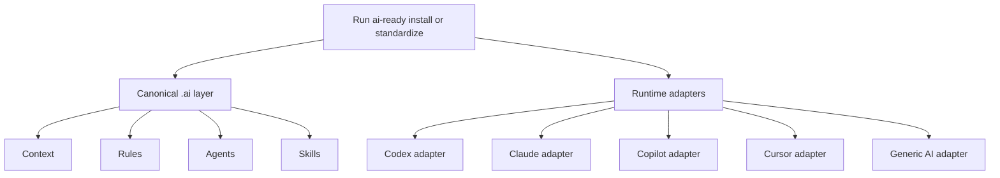
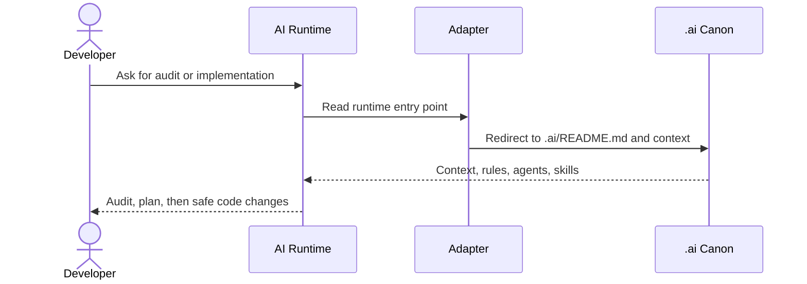

# AI-Ready Bootstrap

Bootstrap, audit, and standardize a canonical AI layer in an existing software repository.

Private repo: `iMark21/ai-ready-bootstrap`

## What This Is

This tool solves a specific problem:

- a repo has no AI-Ready layer yet
- or it has mixed files like `AGENTS.md`, `CLAUDE.md`, Copilot instructions, and ad hoc notes
- and the team wants one canonical source of truth that works across one or several AI tools

The model is simple:

- `.ai/` is canonical
- runtime adapters stay thin and point back to `.ai/`
- you choose exactly which runtimes to support
- `generic` installs `AI-READY.md` as a universal adapter for any AI

`all` expands to `codex,claude,copilot,cursor,generic`.

## Install This CLI

If you have access to the repo, the fastest path is:

```bash
git clone git@github.com:iMark21/ai-ready-bootstrap.git
cd ai-ready-bootstrap
bash install.sh
ai-ready --help
```

By default, `install.sh` installs `ai-ready` into `~/.local/bin`.

If you want a different location:

```bash
bash install.sh --bin-dir "$HOME/bin"
```

If you prefer not to install anything globally yet, you can run the CLI directly from the repo:

```bash
bin/ai-ready --help
```

### Installer Options

```bash
bash install.sh --help
```

Supported flags:

- `--bin-dir PATH` to choose the target directory
- `--copy` to copy the binary instead of symlinking it
- `--force` to replace an existing `ai-ready`

## First Test As An External User

Once the CLI is available, test it against a real repo:

```bash
ai-ready audit /path/to/project
```

Or bootstrap a fresh AI layer:

```bash
ai-ready install /path/to/project \
  --runtimes codex,claude,generic \
  --project-type android
```

If the repo already has AI files, normalize it instead:

```bash
ai-ready standardize /path/to/project \
  --runtimes all \
  --yes
```

## Project Types

| Project Type | Detection Hints | Primary Rules Generated |
| --- | --- | --- |
| `android` | `settings.gradle`, `settings.gradle.kts`, `AndroidManifest.xml` | `.ai/rules/kotlin.md`, `.ai/rules/compose.md` |
| `ios` | `.xcodeproj`, `.xcworkspace`, `Package.swift`, `Podfile` | `.ai/rules/swift.md`, `.ai/rules/swiftui.md` |
| `web` | `package.json`, `pnpm-lock.yaml`, `yarn.lock` | `.ai/rules/typescript.md`, `.ai/rules/react.md` |
| `backend` | `go.mod`, `Cargo.toml`, `pyproject.toml` | `.ai/rules/code.md`, `.ai/rules/ui.md` |
| `generic` | fallback when nothing else matches | `.ai/rules/code.md`, `.ai/rules/ui.md` |

iOS is first-class. The generated iOS guidance explicitly calls out structured concurrency, `@MainActor`, UIKit boundaries, and preview/sample-data expectations.

## Runtime Targets

| Runtime | Adapter |
| --- | --- |
| `codex` | `AGENTS.md` |
| `claude` | `CLAUDE.md` |
| `copilot` | `.github/copilot-instructions.md` plus `.github/instructions/` |
| `cursor` | `.cursor/rules/ai-ready.mdc` |
| `generic` | `AI-READY.md` |

Use `generic` when:

- the AI tool has no native repo instruction format
- you want one cross-runtime handoff file
- the team has not decided yet which assistant will own the repo

## What Gets Installed In The Target Repo

### Canonical Control Plane

| Path | Purpose |
| --- | --- |
| `.ai/README.md` | entry point into the canonical AI layer |
| `.ai/context.md` | compact project summary |
| `.ai/context/architecture.md` | real module/layer map and architectural constraints |
| `.ai/context/dependencies.md` | dependency boundaries and integration notes |
| `.ai/context/features.md` | feature inventory |
| `.ai/context/repository.md` | git workflow, branch policy, commit rules |
| `.ai/context/recent-changes.md` | short-term memory of important repo changes and gotchas |
| `.ai/decision-framework.md` | how to approach features, fixes, refactors, migrations, analytics, new dependencies |

`context.md` starts with `Context Bootstrap Status | Pending first-pass grounding` so the runtime knows the first job is to ground the template in the real repository.

### Rules

These are the guardrails the AI should follow when editing code.

| Path Pattern | Why It Exists |
| --- | --- |
| `.ai/rules/<language>.md` | language-specific engineering constraints such as Kotlin, Swift, or TypeScript |
| `.ai/rules/<ui>.md` | UI-stack constraints such as Compose, SwiftUI, or React |
| `.ai/rules/feature.md` | feature-by-feature structuring guidance |
| `.ai/rules/testing.md` | test expectations before and after changes |
| `.ai/rules/analytics.md` | event naming, payload, and trigger discipline |
| `.ai/rules/data.md` | DTO/domain/persistence boundaries and mapping discipline |

### Agents

These are not background daemons. They are Markdown playbooks that tell the AI which working mode to use and what output is expected.

| Agent File | Why It Exists |
| --- | --- |
| `.ai/agents/proj-explore.md` | audit an unfamiliar area before planning or coding |
| `.ai/agents/proj-context-bootstrap.md` | replace the generated `.ai/context*` templates with real repo-specific knowledge on the first pass |
| `.ai/agents/proj-feature.md` | turn a known feature goal into a file-level implementation plan |
| `.ai/agents/proj-code.md` | execute an approved plan in small verified steps |
| `.ai/agents/proj-verify.md` | verify behavior, run tests, and report residual risk before merge |
| `.ai/agents/proj-fix.md` | fix a defect by reproducing, isolating, and minimizing blast radius |
| `.ai/agents/proj-tech.md` | handle refactors and structural cleanup safely |
| `.ai/agents/proj-spike.md` | run a time-boxed investigation and report options and risk |

### Skills

These are deterministic prompts/checklists the AI can reuse for common operations.

| Skill File | Why It Exists |
| --- | --- |
| `.ai/skills/context-bootstrap.md` | checklist for grounding `.ai/context*` in the real repo immediately after install |
| `.ai/skills/context-refresh.md` | refresh architecture, dependencies, feature map, and recent changes after major repo drift |
| `.ai/skills/feature-scaffold.md` | create the minimum feature boilerplate in the repo's style |
| `.ai/skills/migration-audit.md` | estimate and structure migrations such as legacy UI to modern UI or callbacks to structured async |

### Runtime Adapters

These only exist if selected.

| Adapter | Why It Exists |
| --- | --- |
| `AGENTS.md` | tells Codex to boot from `.ai/` |
| `CLAUDE.md` | tells Claude Code to boot from `.ai/` |
| `.github/copilot-instructions.md` plus `.github/instructions/` | gives Copilot the thin wrappers it expects while keeping `.ai/` canonical |
| `.cursor/rules/ai-ready.mdc` | points Cursor back to `.ai/` |
| `AI-READY.md` | universal fallback adapter for any AI tool without native support |

## Installed Flow



## How It Works After Install

This is the part that often gets misunderstood:

1. the bootstrap does not magically know the real architecture of your repo
2. it installs a canonical skeleton plus repo-working conventions
3. the selected AI runtime reads its adapter
4. that adapter redirects the runtime into `.ai/`
5. if `Context Bootstrap Status` is still pending, the runtime executes `.ai/agents/proj-context-bootstrap.md`
6. from then on, the AI should keep using `.ai/` as the operating memory of the project

So the generated `agents` and `skills` are not meant to be "executed" as independent software. They are working modes and reusable prompts stored as files so the AI behaves consistently.

## First-Pass Context Bootstrap Workflow

This is the new default immediately after `install` or `standardize`.

| Step | Agent / File | Output |
| --- | --- | --- |
| Adapter intake | `AGENTS.md`, `CLAUDE.md`, `AI-READY.md`, or equivalent | runtime is redirected into `.ai/` |
| Bootstrap trigger | `.ai/context.md` | runtime sees `Pending first-pass grounding` |
| Bootstrap execution | `.ai/agents/proj-context-bootstrap.md` | real architecture, dependencies, features, repository workflow, and open questions |
| Bootstrap checklist | `.ai/skills/context-bootstrap.md` | ensures the same evidence-gathering path is followed every time |
| Completion | `.ai/context.md` and `.ai/context/recent-changes.md` | bootstrap status changed from pending to grounded and first pass recorded |

This first pass should not implement product code unless the user explicitly asks for it. Its job is to turn the generated AI layer into a repo-specific control plane.

## Real Workflows

The default mental model is not "many autonomous bots running in parallel".

It is:

- one AI runtime enters through its adapter
- that runtime uses the generated agent playbooks in sequence
- each playbook has a clear responsibility and expected output

If the runtime supports sub-agents, you can split some phases. If not, the same runtime executes the flow step by step.

### 1. New Feature Workflow

| Phase | Agent / File | Who Does It | Output |
| --- | --- | --- | --- |
| Intake | `AGENTS.md`, `CLAUDE.md`, `AI-READY.md`, or equivalent | active runtime | boots from `.ai/` |
| First-pass grounding | `.ai/agents/proj-context-bootstrap.md` and `.ai/skills/context-bootstrap.md` | bootstrap mode | real repo context replaces the template if bootstrap is still pending |
| Repo discovery | `.ai/agents/proj-explore.md` | exploration mode | file map, patterns, risks, reusable references |
| Implementation plan | `.ai/agents/proj-feature.md` | planning mode | files to touch, state/data boundaries, tests, analytics impact |
| Coding | `.ai/agents/proj-code.md` | execution mode | code changes in small verified steps |
| Verification | `.ai/agents/proj-verify.md` plus `.ai/rules/testing.md` | verification mode | test results, manual checks, residual risk |
| Memory update | `.ai/skills/context-refresh.md` and `.ai/context/recent-changes.md` | active runtime | project memory updated after the change |

### 2. Bug Fix Workflow

| Phase | Agent / File | Who Does It | Output |
| --- | --- | --- | --- |
| Reproduction and root cause | `.ai/agents/proj-fix.md` | bug-fix mode | symptom, root cause, affected area |
| Safe implementation | `.ai/agents/proj-code.md` | execution mode | smallest safe fix |
| Regression check | `.ai/agents/proj-verify.md` | verification mode | tests run, regressions checked, open risk |
| Memory update | `.ai/context/recent-changes.md` | active runtime | gotchas and fixes recorded |

### 3. Refactor Or Migration Workflow

| Phase | Agent / File | Who Does It | Output |
| --- | --- | --- | --- |
| Investigation | `.ai/agents/proj-spike.md` or `.ai/skills/migration-audit.md` | research mode | options, effort, risk, recommendation |
| Structure plan | `.ai/agents/proj-tech.md` | technical-planning mode | blast radius, safety net, sequence of changes |
| Execution | `.ai/agents/proj-code.md` | execution mode | incremental structural changes |
| Verification | `.ai/agents/proj-verify.md` | verification mode | regression coverage and deferred risk |

### Who Creates, Who Codes, Who Tests

In practice:

- `proj-context-bootstrap` turns the generated template into a repo-specific AI layer
- `proj-explore` creates the understanding of the area
- `proj-feature` or `proj-tech` creates the implementation plan
- `proj-code` writes the code
- `proj-verify` tests and validates the outcome
- `context-refresh` and `recent-changes.md` keep the AI memory aligned with the repo

So there is a real workflow, but it is encoded as playbooks rather than as a hardwired orchestration engine.

## Runtime Resolution Once Installed



## Typical Usage

### Android Fresh Install

```bash
ai-ready install ~/Developer/android-app \
  --runtimes codex,claude,generic \
  --project-type android \
  --git-name "Name Surname" \
  --git-email "mail@emailme.com" \
  --apply-git-config
```

### iOS Fresh Install

```bash
ai-ready install ~/Developer/ios-app \
  --runtimes codex,claude,generic \
  --project-type ios \
  --git-name "Name Surname" \
  --git-email "mail@emailme.com" \
  --apply-git-config
```

### Existing Repo With Mixed AI Files

```bash
ai-ready audit ~/Developer/mobile-app \
  --report-path /tmp/mobile-ai-audit.md

ai-ready standardize ~/Developer/mobile-app \
  --runtimes codex,claude,copilot,generic \
  --yes
```

### Universal Mode For Any AI

```bash
ai-ready install ~/Developer/unknown-repo \
  --runtimes generic \
  --project-type generic
```

That path creates `.ai/` plus `AI-READY.md`, which is enough to hand the repository to almost any assistant.

## What To Ask The AI After Install

### In Codex

```text
Read AGENTS.md and the canonical .ai layer. Audit this repository, replace the generic placeholders with the real architecture, and then propose the smallest safe next improvements before editing code.
```

### In Claude Code

```text
Read CLAUDE.md and the canonical .ai layer. Summarize the real module structure, identify missing context, and update the AI-Ready docs so they match the actual repository before changing implementation code.
```

### In A Generic AI Tool

```text
Read AI-READY.md and .ai/README.md. Audit the repo, infer the actual architecture, fill the placeholder AI context files, and propose a safe implementation plan that follows the existing project conventions.
```

### In Cursor

If `cursor` was selected, `.cursor/rules/ai-ready.mdc` points Cursor back to `.ai/`. Start with the same audit-first prompt.

## Git Governance

The generated repository guidance mirrors the same discipline used in `ai-workspace`:

- no direct commits on `main`, `develop`, or `master`
- short-lived `feature/*`, `fix/*`, `chore/*`, `docs/*`, `refactor/*` branches
- commit format: `[branch_name] type: "title"`
- no AI `Co-Authored-By` trailers

## CI

GitHub Actions validates:

- shell syntax for `bin/ai-ready`
- shell syntax for `install.sh`
- installer smoke test
- Android fresh-install smoke tests
- iOS fresh-install smoke tests
- standardize-mode smoke tests including the universal generic adapter

## Manual

See [MANUAL.md](MANUAL.md) for the longer operating guide, runtime matrix, manual teammate handoff, and the detailed explanation of how the installed agents, skills, rules, and adapters should be used inside a target repo.
